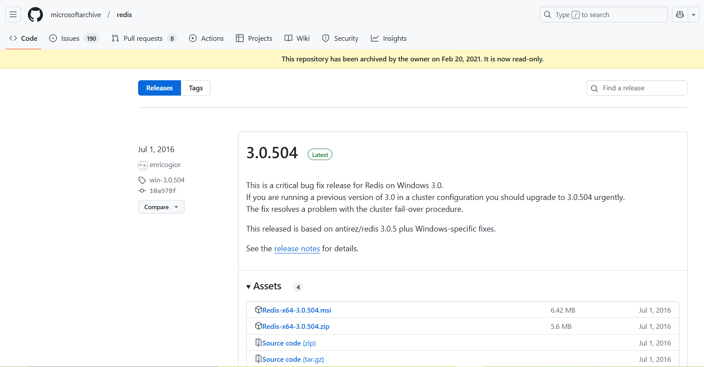
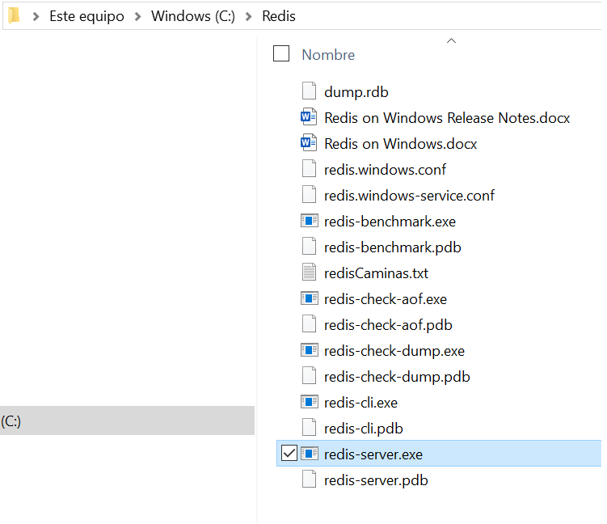
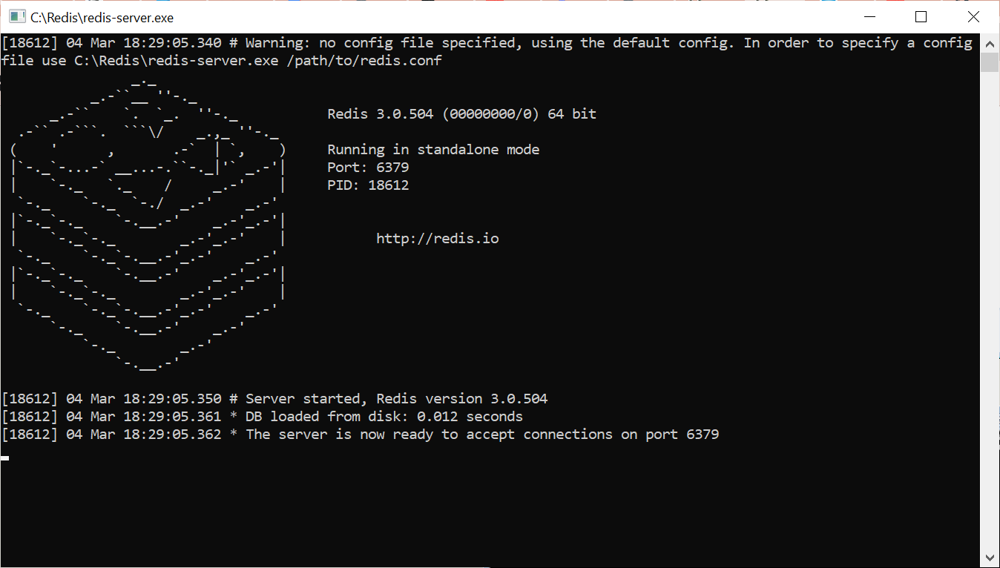
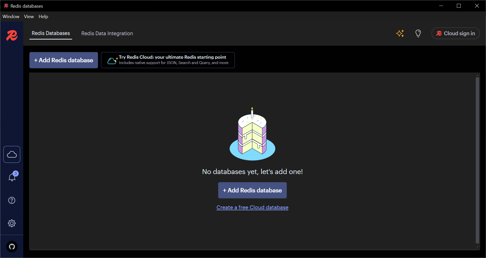
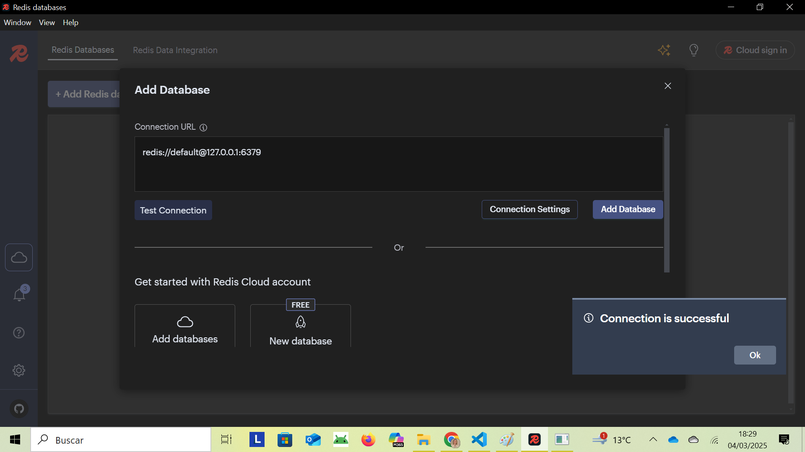

# 2 - Bases de Dades Clau-Valor

Dins dels diferents tipus de **Bases de Dades NoSQL**, les **Bases de Dades Clau-Valor** són les més fàcils de comprendre. Aquest model es basa en parelles **clau-valor**, on cada clau representa un identificador únic i el seu valor associat.  

**🔑 Característica principal:** La clau ha de ser **única**, ja que en cas contrari no es podria recuperar correctament la informació.  

✅ **Avantatge:** No requereix definició de taules ni estructures complexes. Simplement es guarden parelles clau-valor i es recupera la informació mitjançant la clau corresponent.  

---

**🔥 Redis: Un exemple de Base de Dades Clau-Valor**{.azul}

L'exemple més conegut d'aquest tipus de bases de dades és **Redis**, famosa per la seva **potència i eficiència**.  

En Redis, les **claus** sempre són de tipus **String**, mentre que els **valors** poden ser de diferents tipus:  

**📌 Tipus de valors en Redis:**{.azul}  

* **Cadenes de caràcters (String)**  
    - Exemple: nom_1 → "Albert"  

* **Mapes (Hashes)** *(semblants a un registre amb subcamps)*  
    - Exemple: empleat_1 → { nom="Albert", departament="10", sou="1000.0" }  

* **Llistes (Lists)** *(conjunts ordenats de valors)*  
    - Exemple: llista_1 → ["Primer", "Segon", "Tercer"]  

* **Conjunts (Sets)** *(conjunts desordenats de valors, l'ordre és imprevisible)*  
    - Exemple: colors → {"Blau", "Verd", "Roig"}  

* **Conjunts ordenats (Sorted Sets)** *(semblants als Sets, però amb ordre definit)*  
    - Es diferencia de les **llistes** per la forma en què Redis gestiona l'ordenació interna.  

---

**⚙️ Característiques principals de Redis**{.azul}  

🔹 **Arquitectura Client-Servidor**  
Redis segueix un model **client-servidor**, on múltiples clients poden connectar-se a un servidor Redis per llegir i escriure dades.  

🔹 **Alta eficiència i velocitat**  
Redis és extraordinàriament ràpid, especialment quan pot carregar tota la base de dades a **memòria**.  
- Tot i que prioritza la velocitat en memòria, també permet sincronització constant a disc per garantir la **persistència** de les dades.  

🔹 **Replicació Master-Slave per alta disponibilitat**  
- Per suportar alts volums de lectura, Redis permet **replicació** (`master/slave`).  
- Un servidor actua com a **master** i els altres com a **slaves** (rèpliques del master).  
- Els esclaus poden gestionar consultes de lectura per reduir la càrrega sobre el **master**.  

---

## 2.1 - Instal·lació de Redis

Redis està construït per a Linux. També funciona, però, des de Windows com
veurem una miqueta més avant.

### 🐧Instal·lació en Linux

El lloc des d'on baixar-lo és la pàgina oficial:

<https://redis.io/docs/latest/operate/oss_and_stack/install/install-redis/install-redis-from-source/>

En el moment de fer aquestos apunts, l'última versió estable és la **7.4.1**.  

Per obtenir els fitxers font de la darrera versió estable de Redis des del lloc de descàrregues de Redis, executeu:

    wget https://download.redis.io/redis-stable.tar.gz

**Compilando Redis**

Suposarem que el fitxer està col·locat en el lloc on volem que estiga instal·lat de forma definitiva.
Per compilar Redis, primer extrae el fitxer tar, canvia al directori arrel i després executa make:

    tar -xzvf redis-stable.tar.gz
    cd redis-stable
    make

Amb açò s'haurien d'haver generat els executables, i ja hauria de funcionar.

**Executar Servidor i Client Redis**

Per a posar en marxa el servidor, quasi que el més còmode serà obrir un
terminal, situar-nos en el directori **redis-stable/src** i des d'ahi executar
**redis-server**. Hauria d'eixir una finestra similar a la següent, amb més o
menys avisos (observeu que al principi de la imatge estàn les ordres donades per a executar el servidor).

Entre altres coses diu que el servidor està en marxa esperant connexions al
port 6379, que és el port per defecte de Redis. Aquesta finestra del terminal
l'haurem de deixar en marxa. Quan vulguem detenir Redis, senzillament fem
**ctrl-c** , i detindrem l'execució de forma ordenada (guardant-se les dades
no guardades)

Podríem haver executat directament **redis-server** fent-li doble-clic des
d'un explorador d'arxius, per exemple, però aleshores no podríem parar-lo i en
definitiva controlar-lo tan còmodament.

Per a fer una connexió des d'un client, també des d'un terminal (un altre)
executem **redis-cli** :

Ja ha fet la connexió, concretament a localhost (127.0.0.1) i al port 6379,
que havíem quedat que és el port per defecte.

Comprovem que sí que funciona. Encara no hi ha dades, perquè l'acabem
d'instal·lar. I recordeu que és una Base de Dades clau-valor. Per crear una
entrada posarem **set clau valor**. Per a obtenir-la posarem **get clau**. En
la imatge es pot comprovar:

Hem creat una clau anomenada **clau_1** amb el valor **primera** , com es pot
comprovar en el moment d'obtenir-la amb **get**.

**Conexió a un servidor Redis extern**

Si al programa **redis-cli** no li posem paràmetres, intentarà fer una
connexió local (localhost). Si volem connectar a un servidor situat en una
altra adreça, li la posem amb el paràmetre **-h adreça** , per exemple:

    redis-cli -h 192.168.1.26

!!! note "Connexió al servidor de l'Institut"
    En el servidor de dades de l'Institut també tenim instal·lat redis. Però per a
    no tenir accessos no desitjats, cal una autenticació. Senzillament és posar el
    comando **auth** amb la contrasenya que ja hem utilitzat en altres ocasions:
    **auth ieselcaminas.ad**

En la següent imatge es veu com sí que hem pogut connectar

### 🖥️Instal·lació en Windows

Encara que Redis està construït per a Linux, hi ha versions per a Windows,
preferiblement de 64 bits.

El lloc on poder baixar els fitxers de Redis per a Windows de 64 bits és: <https://github.com/MSOpenTech/redis/releases>

!!!Tip ""
    Redis Insight està disponible per a altres sistemes operatius.

Ens baixem el zip, el descomprimim, i ja ho tindrem disponible (sense fer
**make** ni res). Observeu com en la carpeta resultat de descomprimir ja tenim
els executables **redis-server** i **redis-cli** que són els que ens
interessen:

Executem **redis-server** directament i ja el tindrem en marxa:

Executem també el **redis-cli** i el resultat serà el mateix que en Linux.

##  2.2 - Entorn gràfic: Redis Insight

Com hem comprovat en el punt anterior, la connexió que fem des del client és a
través de consola. Per tant haurem de posar comandos i ens contestarà la seua
execució.

Podem instal·lar-nos una aplicació gràfica que faça un poc més atractiva la
presentació.

La instal·lació d'aquesta eina és **totalment optativa**, no cal que la feu.
De fet, ens els exemples que es mostraran en tot el tema només s'utilitzarà el
mode consola.

És completament independent del servidor, i podem instal·lar-la perfectament
sense tenir el servidor, utilitzant-la aleshores per a connectar a un servidor
remot.

El podem baixar lliurement de la pàgina oficial
[redis.io/insight](https://redis.io/insight/) on podrem comprovar que tenim per a totes
les plataformes:

**🖥️Instal·lació en Windows de 64 bits**{.azul}

En Windows el que ens baixarem és un exe. L'executem (permetent l'execució
quan ho pregunta Windows) i li podem donar a totes les opcions per defecte.

Quan l'executem, ens eixirà la següent pantalla:

Podem comprovar que tenim el botó per a afegir una BD Redis (+ Add Redis database). Per a
connectar al servidor local la conexió serà **redis://default@127.0.0.1:6379**. En la imatge
s'ha fet el test de connexió.

Per a connectar a un remot, posarem la seua adreça.

En aquesta imatge es veu com hem connectat perfectament als dos servidors. 

## 2.3 - Utilització de Redis

Anam a veure la utilització de Redis, Ens connectarem com a clients i
intentarem fer operacions.

  * Les primeres seran les més senzilles, utilitzant únicament el tipus de dades **String**.
  * Posteriorment mirarem com treballar amb les claus: buscar-ne una, veure si existeix, buscar unes quantes, ...
  * Després ja anirem a pels tipus de dades més complicats: 
    * **Hash**
    * **List**
    * **Set**
    * **Sorted Set**

### 2.3.1 - Strings

És el tipus de dades més senzill, més bàsic. Serà una cadena de caràcters de
tipus _**binary**_**safe** en la qual normalment guardarem les habituals
cadenes de caràcters, però que també podríem guardar imatges o objectes
serialitzats. La grandària màxima és de 512Mb.

Ara veurem els comandos més habituals que afecten a aquest tipus. Com a norma
general, hem de ser conscients que els comandos no són sensibles a majúscules
o minúscules, però les claus i els valors sí que ho són. És a dir, el comando
**get** també es pot escriure **GET** o **Get**. Però la clau **Hola** és
diferent de la clau **hola**.

#### GET {.azul}

<u>_Sintaxi_</u>

    get clau

Torna el valor de la clau especificada, sempre que siga de tipus **String**.
Si la clau és d'un altre tipus, donarà error. I si la clau no existeix,
tornarà el valor especial **_nil_** .

**<u>Exemples</u>**

    127.0.0.1:6379> get clau_1  
    "primera"  
    127.0.0.1:6379> get clau_2  
    (nil)

#### SET {.azul}

<u>_Sintaxi_</u>

    set clau valor

Assigna a la clau especificada com a primer paràmetre el valor especificat com
a segon paràmetre. Si el valor consta de més d'una paraula, haurà d'anar entre
cometes dobles.

Redis sempre guardarà el valor com a string, encara que nosaltres pensem que
li passem un valor enter o real.

I una altra característica és que si la clau existeix ja, matxacarà el seu
contingut, com era de esperar.

**<u>Exemples</u>**

    127.0.0.1:6379> set clau_2 segona  
    OK  
    127.0.0.1:6379> set text "Un text amb més d'una paraula"  
    OK

    127.0.0.1:6379> set quatre 4  
    OK  
    127.0.0.1:6379> get quatre  
    "4"  
    127.0.0.1:6379> set pi 3.14159265359  
    OK  
    127.0.0.1:6379> get pi  
    "3.14159265359"

----

!!! note "Nota"
    Si poseu algun accent, en tornar el valor (fent get) us semblarà que no s'ha
    guardat bé. Sí que s'haurà guardat bé, el que passa és que posteriorment no es
    visualitza bé en fer el get. Es pot comprovar entrant en el client amb l'opció
    _**raw**_ , és a dir **redis-cli --raw**

----
El comando **SET** té una opció molt interessant, que servirà per a donar un
temps de vida a la clau, transcorregut el qual desapareix la clau (amb el seu
valor clar). Açò s'anomena _**temps d'expiració**_ i s'aconsegueix amb el
paràmetre **EX** del comando **SET** seguit del número de segons que volem que
dure la clau.

**<u>Exemples</u>**

    127.0.0.1:6379> set clau_3 tercera ex 10  
    OK  
    127.0.0.1:6379> get clau_3  
    "tercera"  
    127.0.0.1:6379> get clau_3  
    (nil)

Primer sí que existeix, però al cap de 10 segons ha deixat d'existir.

De forma equivalent es pot expressar el temps en milisegons, amb el paràmetre
**PX** en compte de **EX**.

Havíem comentat al principi, que si en el moment de fer el **SET** la clau ja
existia, es reemplaçarà el seu contingut. Podem modificar aquest comportament
amb el paràmetre **NX** (Not eXists): si no existia la clau, la crearà amb el
valor, però si ja existia, la deixarà com estava. Ens ho indicarà dient OK en
cas de crear-la i NIL en cas de no crear-la perquà ja existia.

    127.0.0.1:6379> set clau_4 quarta nx  
    OK  
    127.0.0.1:6379> set clau_1 quarta nx  
    (nil)  
    127.0.0.1:6379> get clau_4  
    "quarta"  
    127.0.0.1:6379> get clau_1  
    "primera"

I de forma inversa, si posem el paràmetre **XX** , si ja existeix la clau,
reemplaçarà el valor, però si no existia, no farà res.

#### SETEX {.azul}

<u>_Sintaxi_</u>

    setex clau segons valor

Funciona igual que el **SET** amb el paràmetre **EX** : crearà la clau amb el
valor, però tindrà una existència dels segons indicats.

#### PSETEX {.azul}

<u>_Sintaxi_</u>

    psetex clau milisegons valor

Funciona igual que l'anterior, però el que especifiquem són els milisegons
d'existència.

#### MGET {.azul} 

<u>_Sintaxi_</u>

    mget clau1 clau2 clauN

Torna una llista de valors, els de les claus indicades.

**<u>Exemples</u>**

    127.0.0.1:6379> set mes1 gener  
    OK  
    127.0.0.1:6379> set mes2 febrer  
    OK  
    127.0.0.1:6379> set mes3 març  
    OK  
    127.0.0.1:6379> mget mes1 mes2 mes3  
    1) "gener"  
    2) "febrer"  
    3) "mar\xc3\xa7"

----
!!! note "Nota"
    Recordeu que els caràcters com vocals accentuades, ç, ñ, ... s'han introduït
    bé, però potser no es visualiten bé. Es pot evitar entrant en el client
    d'aquesta manera **redis-cli --raw**
----
Si alguna de les claus no exiteix, tornarà **nil** en el seu lloc

#### MSET {.azul}

<u>_Sintaxi_</u>

    mset clau1 valor1 clau2 valor2 clauN valorN

Assigna els valors corresponents a les claus. És una operació atòmica: es
posen (o canvien) tots els valors a l'hora.

    127.0.0.1:6379> mset mes4 abril mes5 maig mes6 juny mes7 juliol  
    OK  
    127.0.0.1:6379> mget mes1 mes2 mes3 mes4 mes5 mes6 mes7  
    1) "gener"  
    2) "febrer"  
    3) "mar\xc3\xa7"  
    4) "abril"  
    5) "maig"  
    6) "juny"  
    7) "juliol"

Si no vulguérem reemplaçar valors, podríem utilitzar el comando **MSETNX** ,
totalment equivalent, però hauríem de tenir en compte que si alguna ja
existeix i per tant no pot canviar el valor, no faria l'operació, és a dir,
tampoc crearia les altres.

#### APPEND {.azul}

<u>_Sintaxi_</u>

    append clau1 valor1

Si la clau no existeix la crea assignant-li el valor (com el **SET**), però si
ja existeix, concatena el valor al final de la cadena que ja hi havia.

    127.0.0.1:6379> append salutacio Hola  
    (integer) 4  
    127.0.0.1:6379> get salutacio  
    "Hola"  
    127.0.0.1:6379> append salutacio ", com va?"  
    (integer) 13  
    127.0.0.1:6379> get salutacio  
    "Hola, com va?"

#### STRLEN {.azul}

<u>_Sintaxi_</u>

    strlen clau1

Torna el número de caràcters que hi ha en el valor de la clau. Si la clau no
existeix, tornarà 0. Si la clau és d'un altre tipus, tornarà error.

    127.0.0.1:6379> strlen salutacio  
    (integer) 13  
    127.0.0.1:6379> strlen sal  
    (integer) 0

#### GETRANGE {.azul}

<u>_Sintaxi_</u>

    getrange clau1 inici final

Extrau una subcadena del valor de la clau (ha de ser de tipus **String**) des
del número de caràcter d'inici fins al número del final (ambdós inclosos). El
primer caràcter és el 0. Si posem de final un número major que l'últim, igual
ho traurà fins el final.

Es poden posar també valor negatius que ens ajuden a agafar la cadena des del
final. El -1 és l'últim caràcter, el -2 el penúltim, ... I es poden barrejar
números positius i negatius. Així el rang 0 -1 és tota la cadena.

    127.0.0.1:6379> getrange salutacio 1 3  
    "ola"  
    127.0.0.1:6379> getrange salutacio 6 50  
    "com va?"  
    127.0.0.1:6379> getrange salutacio 6 -1  
    "com va?"  
    127.0.0.1:6379> getrange salutacio -7 -5  
    "com"

#### SETRANGE {.azul}

<u>_Sintaxi_</u>

    setrange clau1 desplaçament valor

Substitueix part del valor de la cadena, a partir del desplaçament, amb el
vaolr proporcionat. No s'admenten en desplaçament valors negatius.

    127.0.0.1:6379> get salutacio  
    "Hola, com va?"  
    127.0.0.1:6379> setrange salutacio 4 ". C"  
    (integer) 13  
    127.0.0.1:6379> get salutacio  
    "Hola. Com va?"

#### INCR {.azul}

<u>_Sintaxi_</u>

    incr clau1

A pesar de que Redis guarda els strings com a tals, com a cadenes de
caràcters, en algunes ocasions és capaç de transformar la cadena a un número.
És el cas del comando **INCR** , que converteix la cadena en un enter (si pot)
i incrementa aquest valor en una unitat.

Si la clau no existeix la crea assumint que valia 0, i per tant després valdrà
1.

Si el valor de la clau no era un número enter, donarà un error.

    127.0.0.1:6379> set compt1 20  
    OK  
    127.0.0.1:6379> get compt1  
    "20"  
    127.0.0.1:6379> incr compt1  
    (integer) 21  
    127.0.0.1:6379> get compt1  
    "21"  
    127.0.0.1:6379> incr compt2  
    (integer) 1  
    127.0.0.1:6379> get compt2  
    "1"  
    127.0.0.1:6379> incr clau_1  
    (error) ERR value is not an integer or out of range  
    127.0.0.1:6379> set compt3 4.25  
    OK  
    127.0.0.1:6379> incr compt3  
    (error) ERR value is not an integer or out of range

#### DECR {.azul}

<u>_Sintaxi_</u>

    decr clau1

Decrementa en una unitat el valor de la clau (senpre que siga un enter).

Pot agafar valors negatius.

Si la clau no existeix la crea assumint que valia 0, i per tant després valdrà
-1.

    127.0.0.1:6379> decr compt2  
    (integer) 0  
    127.0.0.1:6379> decr compt2  
    (integer) -1  
    127.0.0.1:6379> get compt2  
    "-1"

#### INCRBY {.azul}

<u>_Sintaxi_</u>

    incrby clau1 increment

Incrementa el valor de la clau en el número d'unitats indicat en **increment**
(el valor ha de ser enter). L'increment pot ser negatiu.

    127.0.0.1:6379> incrby compt1 10  
    (integer) 31  
    127.0.0.1:6379> incrby compt1 -20  
    (integer) 11

#### DECRBY {.azul}

<u>_Sintaxi_</u>

    decrby clau1 decrement

Decrementa el valor de la clau el número d'unitat indicat en **decrement**.

    127.0.0.1:6379> decrby compt1 5  
    (integer) 6

### 2.3.2 - Keys

Ara anem a veure comandos que ens permeten treballar amb les claus, per a
buscar-les, veure si existeixen, etc. No importarà el tipus de les claus (de
moment només hem treballat amb claus de tipus **String** , però si ja en
tinguérem dels altres tipus també es veurien afectades). En cap cas d'aquestos
comandos accedirem al valor de les claus.

#### KEYS {.azul}

<u>_Sintaxi_</u>

    keys patró

Torna totes les claus que coincideixen amb el patró. En el patró podem posar
caràcters comodí:

  * ***** : equival a 0 o més caràcters. Per exemple "Mar*a" podria tornar "Mara", "Maria", "Marta", "Margarita", ...
  * **?** : equival exactament a un caràcter. Per exemple "Mar?a" podria tornar "Maria" o "Marta", però no "Mara", "Margarita", ...
  * **[ab]** : serà cert si en el lloc corresponent hi ha un dels caràcters especificats entre els claudàtors. Per exemple "Mar[it]a" podria tornar "Maria" o "Marta", però no "Marga"

Per a tornar totes les claus utilitzarem **keys ***

    127.0.0.1:6379> keys *  
    1) "compt3"  
    2) "mes5"  
    3) "mes3"  
    4) "comp3"  
    5) "mes7"  
    6) "mes2"  
    1) "mes6"  
    2) "salutacio"  
    3) "mes4"  
    4)  "mes1"  
    5)  "clau_1"  
    6)  "compt1"  
    7)  "compt2"  
    127.0.0.1:6379> keys mes?  
    1) "mes5"  
    2) "mes3"  
    3)  "mes7"  
    4)  "mes2"  
    5)  "mes6"  
    6)  "mes4"  
    7)  "mes1"  
    127.0.0.1:6379> keys c*  
    1)  "compt3"  
    2)  "comp3"  
    3)  "clau_1"  
    4)  "compt1"  
    5)  "compt2"  
    127.0.0.1:6379> keys mes[125]  
    1)  "mes5"  
    2)  "mes2"  
    3)  "mes1"

#### EXISTS {.azul}

<u>_Sintaxi_</u>

    exists clau

Torna 1 si la clau existeix, i 0 si no existeix. No importa de quin tipus siga
la clau.

    127.0.0.1:6379> exists clau_1  
    (integer) 1  
    127.0.0.1:6379> exists clau_25  
    (integer) 0

#### DEL {.azul}

<u>_Sintaxi_</u>

    del clau1 clau2 clauN

Elimina la clau o claus especificades. Si posem més d'una clau i alguna no
existeix, la ignorarà i sí que esborrarà les altres.

    127.0.0.1:6379> del compt2  
    (integer) 1  
    127.0.0.1:6379> del mes6 mes7 mes8 mes9  
    (integer) 2

Observeu que ens indica quantes claus ha esborrat. En el primer exemple ha
esborrat la clau especificada, i en el segon diu que ha esborrat 2, que seran
**mes6** i **mes7** , ja que **mes8** i **mes9** no existien.

#### TYPE {.azul}

<u>_Sintaxi_</u>

    type clau

Torna el tipus de la clau especificada. Els valors possibles són:

  * string
  * hash
  * list
  * set
  * zset (conjunt ordenat)

**<u>Exemples</u>**

    127.0.0.1:6379> type clau_1  
    string  

#### RENAME {.azul}

<u>_Sintaxi_</u>

    rename clau novaclau

Canvia el nom de la clau a la clau nova, conservant el valor. Dóna error si la
clau antiga no existeix. Si la clau nova ja existia reemplaçarà el seu valor.

**<u>Exemples</u>**

    127.0.0.1:6379> get salutacio  
    "Hola. Com va?"  
    127.0.0.1:6379> rename salutacio saludar  
    OK  
    127.0.0.1:6379> get salutacio  
    (nil)  
    127.0.0.1:6379> get saludar  
    "Hola. Com va?"  
    127.0.0.1:6379> rename clau_22 clau_23  
    (error) ERR no such key

#### RENAMENX {.azul}

<u>_Sintaxi_</u>

    renamenx clau novaclau

Igual que l'anterior però únicament si la clau nova no existia. Si ja existia
no fa res (tornant 0 per a indicar-h0).

**<u>Exemples</u>**

    127.0.0.1:6379> renamenx compt1 compt3  
    (integer) 0  
    127.0.0.1:6379> get compt1  
    "9"

Estem suposant que la clau **compt3** ja existeix

#### EXPIRE {.azul}

<u>_Sintaxi_</u>

    expire clau segons

Assigna com a temps d'expiració de la clau els segons especificats. Si ja
tenia temps d'expiració, el modifica posant-li aquest valor especificat.

En cas que a una clau amb temps d'expiració li canviem el nom amb **RENAME** ,
continuarà amb temps d'expiració que li quedava.

#### PEXPIRE {.azul}

<u>_Sintaxi_</u>

    pexpire clau milisegons

El mateix però en milisegons

#### TTL {.azul}

<u>_Sintaxi_</u>

    ttl clau

Torna el temps de vida (fins l'expiració) d'una clau. Si la clau no té temps
d'expiració, torna -1.

**<u>Exemples</u>**

    127.0.0.1:6379> expire compt3 10  
    (integer) 1  
    127.0.0.1:6379> ttl compt3  
    (integer) 6  
    127.0.0.1:6379> ttl compt3  
    (integer) 3  
    127.0.0.1:6379> ttl compt3  
    (integer) 0  
    127.0.0.1:6379> get compt3  
    (nil)

#### PTTL {.azul}

<u>_Sintaxi_</u>

    pttl clau

Igual que l'anterior, però ens torna el temps en milisegons.

#### PERSIST {.azul}

<u>_Sintaxi_</u>

    persist clau

Elimina el temps d'expiració d'una clau, si és que en tenia. Ara la clau no
expirarà mai.

**<u>Exemples</u>**

    127.0.0.1:6379> expire compt1 20  
    (integer) 1  
    127.0.0.1:6379> ttl compt1  
    (integer) 12  
    127.0.0.1:6379> ttl compt1  
    (integer) 7  
    127.0.0.1:6379> persist compt1  
    (integer) 1  
    127.0.0.1:6379> ttl compt1  
    (integer) -1  
    127.0.0.1:6379> get compt1  
    "9"

### 2.3.3 - Hash

Ja havíem comentat que el tipus **Hash** és una espècie de registre, amb
subcamps (en realitat hauríem de dir sub-claus). Pot tenir qualsevol número de
subcamps que són de tipus String.

**Redis** és molt eficient en quant a l'espai que ocupen els **Hash** , i
sobretot en el temps de recuperació de les dades.

Els comandos que vam veure per al **String** no es poden aplicar al **Hash**.
Tanmateix els comandos del **Hash** són molt similars a aquells, començant
sempre per **H**.

#### HSET {.azul}

<u>_Sintaxi_</u>

    hset clau camp valor

Assigna al camp especificat de la clau especificada el valor especificat. Si
el valor consta de més d'una paraula, haurà d'anar entre cometes dobles.

Si la clau no existia, la crearà, i si ja existia, senzillament afegirà el
camp. I si d'aquesta clau ja existia el camp, modificarà el seu valor.

Evidentment, en claus diferents poden haver camps amb els mateixos noms.

**<u>Exemples</u>**

    127.0.0.1:6379> hset empleat_1 nom Andreu  
    (integer) 1  
    127.0.0.1:6379> hset empleat_1 departament 10  
    (integer) 1  
    127.0.0.1:6379> hset empleat_1 sou 1000.0  
    (integer) 1

    127.0.0.1:6379> hset empleat_2 nom Berta  
    (integer) 1  
    127.0.0.1:6379> hset empleat_2 sou 1500.0  
    (integer) 1

#### HGET {.azul}

<u>_Sintaxi_</u>

    hget clau camp

Torna el valor del camp de la clau. Si no existia (el camp o la clau) torna
**nil**. Només podem especificar un camp.

**<u>Exemples</u>**

    127.0.0.1:6379> hget empleat_1 nom  
    "Andreu"  
    127.0.0.1:6379> hget empleat_1 departament  
    "10"  
    127.0.0.1:6379> hget empleat_2 nom  
    "Berta"  
    127.0.0.1:6379> hget empleat_2 departament  
    (nil)

#### HGETALL {.azul}

<u>_Sintaxi_</u>

    hgetall clau

Torna una llista amb tots els camps i els seus valors de la clau. La seqüència
és: camp1 valor1 camp2 valor2 ... Però no ens podem fiar que l'ordre siga el
mateix ordre que quan el vam definir.

**<u>Exemples</u>**

  127.0.0.1:6379> hgetall empleat_1  
    1) "nom"  
    2) "Andreu"  
    3) "departament"  
    4) "10"  
    5) "sou"  
    6) "1000.0"

#### HDEL {.azul}

<u>_Sintaxi_</u>

    hdel clau camp1 camp2 campN

Elimina el o els camps especificats. Si no existeixen algun d'ells,
senzillament l'ignora i si que elimina els altres.

**<u>Exemples</u>**

    127.0.0.1:6379> hdel empleat_1 departament  
    (integer) 1  
    127.0.0.1:6379> hgetall empleat_1  
    1) "nom"  
    2) "Andreu"  
    3) "sou"  
    4) "1000.0"

#### HKEYS {.azul}

<u>_Sintaxi_</u>

    hkeys clau

Torna una llista amb els camps de la clau. Si la clau no existia, torna una
llista buida

**<u>Exemples</u>**

    127.0.0.1:6379> hkeys empleat_1  
    1) "nom"  
    2) "sou"

#### HVALS {.azul}

<u>_Sintaxi_</u>

    hvals clau

Torna una llista amb els valors (únicament els valors) de tots els camps de la
clau. Si la clau no existia, torna una llista buida

**<u>Exemples</u>**

    127.0.0.1:6379> hvals empleat_1  
    1) "Andreu"  
    2) "1000.0"

#### Altres Comandos

També existeixen altres comandos, de funcionament com cabria esperar (els hem
vist tots en el cas de **String**):

  * **hmget** : Torna més d'un camp de la clau
  * **hmset** : assigna més d'un camp a una clau
  * **hexists** : indica si existeix el subcamp de la clau
  * **hsetnx** : assigna únicament en cas de que no existisca el camp.
  * **hincrby** : incrementa el camp de la clau

### 2.3.4 - List

Les **Llistes** en **Redis** són llistes de Strings ordenades, on cada element
està associat a un índex de la llista. Es poden recuperar els elements tant de
forma ordenada (per l'índex) com accedint directament a una posició.

- Els elements es poden afegir al principi, al final o també en una posició
determinada.

- La llista es crea en el moment en què s'insereix el primer element, i
desapareix quan llevem l'últim element que quede.

- Estan molt ben optimitzades per a la inserció i per a la consulta.

- Els comandos que afecten a les llistes comencen quasi tots per **L** , excepte
alguns que comencen per **R** indicant que fan l'operació per la dreta.

- Els valors dels elements es poden repetir.

#### LPUSH {.azul}

<u>_Sintaxi_</u>

    lpush clau valor1 valor2 valorN

Introdueix els valors a la llista (creant la clau si és necessari). Les
insereix en la primera posició, o també podríem dir que per l'esquerra (**Left
PUSH**), imaginant que els elements estan ordenats d'esquerra a dreta. Si
posem més d'un valor, s'aniran introduint sempre en la primera posició. El
comando tornarà el número d'elements (strings) de la llista després de la
inserció.

**<u>Exemples</u>**

    127.0.0.1:6379> lpush llista1 primera segona tercera  
    (integer) 3  
    127.0.0.1:6379> lrange llista1 0 -1  
    1) "tercera"  
    2) "segona"  
    3) "primera"  
    127.0.0.1:6379> lpush llista1 quarta cinquena  
    (integer) 5  
    127.0.0.1:6379> lrange llista1 0 -1  
    1) "cinquena"  
    2) "quarta"  
    3) "tercera"  
    4) "segona"  
    5) "primera"  

!!! note "Nota"
    Per a veure el contingut de la llista utilitzarem el comando **lrange llista 0
    -1** , que torna la llista sencera. Veurem de forma més completa aquest
    comando amb posterioritat.

#### RPUSH {.azul}

<u>_Sintaxi_</u>

    rpush clau valor1 valor2 valorN

Introdueix els valors a la llista (creant la clau si és necessari). Les
insereix en l'última posició, o també podríem dir que per la dreta (**Right
PUSH**), imaginant que els elements estan ordenats d'esquerra a dreta. El
comando tornarà el número d'elements (strings) de la llista després de la
inserció.

**<u>Exemples</u>**

    127.0.0.1:6379> rpush llista1 sisena setena  
    (integer) 7  
    127.0.0.1:6379> lrange llista1 0 -1  
    1) "cinquena"  
    2) "quarta"  
    3) "tercera"  
    4) "segona"  
    5) "primera"  
    6) "sisena"  
    7) "setena"  

#### LPOP {.azul}

<u>_Sintaxi_</u>

    lpop clau

Torna i elimina el primer element (el de més a l'esquerra).

**<u>Exemples</u>**

    127.0.0.1:6379> lpop llista1  
    "cinquena"  
    127.0.0.1:6379> lrange llista1 0 -1  
    1) "quarta"  
    2) "tercera"  
    3) "segona"  
    4) "primera"  
    5) "sisena"  
    6) "setena"  

#### RPOP {.azul}

<u>_Sintaxi_</u>

    rpop clau

Torna i elimina l'últim element (el de més a la dreta).

**<u>Exemples</u>**

    127.0.0.1:6379> rpop llista1  
    "setena"  
    127.0.0.1:6379> lrange llista1 0 -1  
    1) "quarta"  
    2) "tercera"  
    3) "segona"  
    4) "primera"  
    5) "sisena"  

#### LSET {.azul}

<u>_Sintaxi_</u>

    lset clau index valor

Substitueix el valor de la posició indicada per l'índex. Tant la clau com
l'element de la posició indicada han d'existir, sinó donarà error. Ara la
**L** no significa **Left** sinó **List**.

La primera posició és la 0. I també es poden posar números negatius: -1 és
l'últim, -2 el penúltim, ...

**<u>Exemples</u>**

    127.0.0.1:6379> lset llista1 2 quarta  
    OK  
    127.0.0.1:6379> lrange llista1 0 -1  
    1) "quarta"  
    2) "tercera"  
    3) "quarta"  
    4) "primera"  
    5) "sisena"  
    127.0.0.1:6379> lset llista1 -1 cinquena  
    OK  
    127.0.0.1:6379> lrange llista1 0 -1  
    1) "quarta"  
    2) "tercera"  
    3) "quarta"  
    4) "primera"  
    5) "cinquena"  

Observeu com es poden repetir els valors

#### LINDEX {.azul}

<u>_Sintaxi_</u>

    lindex clau index

Torna l'element situat en la posició indicada per l'índex, **però sense
eliminar-lo de la llista**.

**<u>Exemples</u>**

    127.0.0.1:6379> lrange llista1 0 -1  
    1) "quarta"  
    2) "tercera"  
    3) "quarta"  
    4) "primera"  
    5) "cinquena"  
    127.0.0.1:6379> lindex llista1 0  
    "quarta"  
    127.0.0.1:6379> lindex llista1 3  
    "primera"  
    127.0.0.1:6379> lindex llista1 -1  
    "cinquena"  
    127.0.0.1:6379> lrange llista1 0 -1 
    1) "quarta"  
    2) "tercera"  
    3) "quarta"  
    4) "primera"  
    5) "cinquena"  

#### LINSERT {.azul}

<u>_Sintaxi_</u>

    linsert clau BEFORE | AFTER valor1 valor2

Insereix el valor2 abans o després (segons el que triem) de la primera vegada
que troba el valor1. No substitueix, sinó que insereix en una determinada
posició. Els elements que van després de l'element introduït veuran
actualitzat el seu índex.

**<u>Exemples</u>**

    127.0.0.1:6379> lrange llista1 0 -1  
    1) "quarta"  
    2) "tercera"  
    3) "quarta"  
    4) "primera"  
    5) "cinquena"  
    127.0.0.1:6379> linsert llista1 AFTER quarta segona  
    (integer) 6  
    127.0.0.1:6379> lrange llista1 0 -1  
    1) "quarta"  
    2) "segona"  
    3) "tercera"  
    4) "quarta"  
    5) "primera"  
    6) "cinquena"  
    127.0.0.1:6379> linsert llista1 BEFORE cinquena sisena  
    (integer) 7  
    127.0.0.1:6379> lrange llista1 0 -1  
    1) "quarta"  
    2) "segona"  
    3) "tercera"  
    4) "quarta"  
    5) "primera"  
    6) "sisena"  
    7) "cinquena"  
    127.0.0.1:6379> lrange llista1 0 -1    

Si intentem inserir abans o després un element que no existeix, tornarà -1
indicant que no l'ha trobat i no farà la inserció.

    127.0.0.1:6379> linsert llista1 BEFORE desena setena  
    (integer) -1  
    127.0.0.1:6379> lrange llista1 0 -1  
    1) "quarta"  
    2) "segona"  
    3) "tercera"  
    4) "quarta"  
    5) "primera"  
    6) "sisena"  
    7) "cinquena"  
  

#### LRANGE {.azul}

  <u>_Sintaxi_</u>
  
      lrange clau inici final
  
  Torna els elements de la llista inclosos entre els index inici i final, ambdós
  inclosos. El primer element és el 0. Es poden posar valors negatius, sent -1
  l'últim, -2 el penúltim, ...

  **<u>Exemples</u>**
  
    127.0.0.1:6379> lrange llista1 0 -1  
    1) "quarta"  
    2) "segona"  
    3) "tercera"  
    4) "quarta"  
    5) "primera"  
    6) "sisena"  
    7) "cinquena"  
    127.0.0.1:6379> lrange llista1 2 4  
    1) "tercera"  
    2) "quarta"  
    3) "primera"  
    127.0.0.1:6379> lrange llista1 1 -2  
    4) "segona"  
    5) "tercera"  
    6) "quarta"  
    7) "primera"  
    8) "sisena"  
    127.0.0.1:6379> lrange llista1 4 4  
    1) "primera"  

#### LLEN {.azul}

<u>_Sintaxi_</u>

    llen clau

Torna el número d'elements de la llista

**<u>Exemples</u>**

    127.0.0.1:6379> llen llista1  
    (integer) 7  

#### LREM {.azul}

<u>_Sintaxi_</u>

    lrem clau número valor

Elimina elements de la llista que coincidisquen amb el valor proporcionat. Ja
sabem que els valors es poden repetir. Amb el número indiquem quants elements
volem que s'esborrencomençant per l'esquerra: si posem 1 s'esborrarà el primer
element amb aquest valor, si posem 2 s'esborraran els dos primers elements
(els de més a l'esquerra) que tingen aquest valor. Si posem 0 s'esborraran
tots els elements amb aquest valor

**<u>Exemples</u>**

    127.0.0.1:6379> rpush llista1 segona  
    (integer) 8  
    127.0.0.1:6379> lrange llista1 0 -1  
    1) "quarta"  
    2) "segona"  
    3) "tercera"  
    4) "quarta"  
    5) "primera"  
    6) "sisena"  
    7) "cinquena"  
    8) "segona"  
    127.0.0.1:6379> lrem llista1 1 segona  
    (integer) 1  
    127.0.0.1:6379> lrange llista1 0 -1  
    1) "quarta"  
    2) "tercera"  
    3) "quarta"  
    4) "primera"  
    5) "sisena"  
    6) "cinquena"  
    7) "segona"  
    127.0.0.1:6379> lrem llista1 0 quarta  
    (integer) 2  
    127.0.0.1:6379> lrange llista1 0 -1 
    8) "tercera"  
    9) "primera"  
    10) "sisena"  
    11) "cinquena"  
    12) "segona"  

#### LTRIM {.azul}

<u>_Sintaxi_</u>

    ltrim clau inici final

Elimina els elements que queden fora dels índex inici i final, és a dir
elimina els que estiguen a l'esquerra d'inici, i els que estiguen a la dreta
de final.

**<u>Exemples</u>**

    127.0.0.1:6379> ltrim llista1 1 -2  
    OK  
    127.0.0.1:6379> lrange llista1 0 -1  
    1) "primera"  
    2) "sisena"  
    3) "cinquena"  

### 2.3.5 - Set

Els **Sets** de **Redis** són conjunts de valors de tipus String no ordenats.
Podrem afegir, actualitzar i esborrar aquestos elements de forma còmoda i
eficient. No es permetran els valors duplicats.

A més **Redis** ens ofereix operacions interessants com la unió, intersecció i
diferència de conjunts.

Com sempre, els comandos són específics, és a dir no ens valen els de Strings,
List o Hash. Tots els comandos comencen per **S**.

#### SADD {.azul}

<u>_Sintaxi_</u>

    sadd clau valor1 valor2 valorN

Afegeix els valors al conjunt (creant la clau si és necessari). Recordem que
l'ordre no és important, i que no es poden repetir els valors; si intentem
introduir un repetit, no donarà error, però no l'introduirà. El comando
tornarà el número d'elements que realment s'han afegit.

**<u>Exemples</u>**

    127.0.0.1:6379> sadd colors roig verd blau  
    (integer) 3  
    127.0.0.1:6379> sadd colors verd groc  
    (integer) 1

#### SMEMBERS {.azul}

<u>_Sintaxi_</u>

    smembers clau

Torna tots els valors del conjunt. Si la clau no existeix tornarà un conjunt
buit. Recordeu que l'ordre dels elements no és predecible

**<u>Exemples</u>**

    127.0.0.1:6379> smembers colors  
    1) "groc"  
    2) "verd"  
    3) "roig"  
    4) "blau"

#### SISMEMBER {.azul} 

<u>_Sintaxi_</u>

    sismember clau valor

Comprova si el valor està en el conjunt, tornant 1 en cas afirmatiu i 0 en cas
negatiu.

**<u>Exemples</u>**

    127.0.0.1:6379> sismember colors verd  
    (integer) 1  
    127.0.0.1:6379> sismember colors negre  
    (integer) 0

#### SCARD {.azul}

<u>_Sintaxi_</u>

    sard clau

Torna la cardinalitat, és a dir, el número d'elements del conjunt en
l'actualitat.

**<u>Exemples</u>**

    127.0.0.1:6379> scard colors  
    (integer) 4

#### SREM {.azul}

<u>_Sintaxi_</u>

    srem clau valor1 valor2 valorN

Elimina els valors del conjunt. Si el conjunt es queda buit, eliminarà la clau
també. Si algun dels valor no és cap element del conjunt, senzillament
s'ignorarà. El comando torna el número d'elements realment eliminat.

**<u>Exemples</u>**

    127.0.0.1:6379> srem colors verd negre  
    (integer) 1  
    127.0.0.1:6379> smembers colors  
    1) "groc"  
    2) "roig"  
    3) "blau"

#### SPOP {.azul}

<u>_Sintaxi_</u>

    spop clau

Torna i elimina un valor aleatori del conjunt. Recordeu que a més de tornar-
lo, l'elimina del conjunt.

**<u>Exemples</u>**

    127.0.0.1:6379> smembers colors  
    1) "groc"  
    2) "roig"  
    3) "blau"  
    127.0.0.1:6379> spop colors  
    "groc"  
    127.0.0.1:6379> smembers colors  
    1) "roig"  
    2) "blau"

#### SRANDMEMBER {.azul}

<u>_Sintaxi_</u>

    srandmember clau

Molt paregut a l'anterior. Torna un valor aleatori del conjunt, però en
aquesta ocasió no l'elimina del conjunt.

**<u>Exemples</u>**

    127.0.0.1:6379> srandmember colors  
    "blau"  
    127.0.0.1:6379> smembers colors  
    1) "roig"  
    2) "blau"

#### SUNION {.azul}

<u>_Sintaxi_</u>

    sunion clau1 clau2 clauN

Torna la unió dels elements dels conjunts especificats. És una unió correcta,
és a dir, no es repetirà cap valor.

No modifica cap conjunt, i el resultat únicament es torna, no es guarda en cap
lloc de forma permanent.

**<u>Exemples</u>**

    127.0.0.1:6379> smembers colors  
    1) "roig"  
    2) "blau"  
    127.0.0.1:6379> sadd colors1 verd roig groc  
    (integer) 3  
    127.0.0.1:6379> smembers colors1  
    1) "groc"  
    2) "roig"  
    3) "verd"  
    127.0.0.1:6379> sunion colors colors1  
    1) "verd"  
    2) "groc"  
    3) "roig"  
    4) "blau"

#### SUNIONSTORE {.azul}
<u>_Sintaxi_</u>

    sunionstore clau_destí clau1 clau2 clauN

Igual que l'anterior, però ara sí que es guarda el resultat de la unió en un
conjunt, clau_destí (el primer especificat). Si la clau_destí ja existia,
substituirà el contingut.

**<u>Exemples</u>**

    127.0.0.1:6379> smembers colors  
    1) "roig"  
    2) "blau"  
    127.0.0.1:6379> smembers colors1  
    1) "groc"  
    2) "roig"  
    3) "verd"  
    127.0.0.1:6379> sunionstore colors2 colors colors1  
    (integer) 4  
    127.0.0.1:6379> smembers colors2  
    1) "verd"  
    2) "groc"  
    3) "roig"  
    4) "blau"

#### SDIFF {.azul}

<u>_Sintaxi_</u>

    sdiff clau1 clau2 clauN

Torna la diferència dels elements del primer conjunt respecte de la unió de
tots els altres. És a dir, torna els elements del primer conjunt que no
pertanyen acap dels altres.

No modifica cap conjunt, i el resultat únicament es torna, no es guarda en cap
lloc de forma permanent.

**<u>Exemples</u>**

    127.0.0.1:6379> smembers colors  
    1) "roig"  
    2) "blau"  
    127.0.0.1:6379> smembers colors1  
    1) "groc"  
    2) "roig"  
    3) "verd"  
    127.0.0.1:6379> sdiff colors1 colors  
    1) "verd"  
    2) "groc"

#### SDIFFSTORE {.azul}

<u>_Sintaxi_</u>

    sdiffstore clau_destí clau1 clau2 clauN

Igual que l'anterior, però ara sí que es guarda el resultat de la diferència
en un conjunt, clau_destí (el primer especificat). Si la clau_destí ja
existia, substituirà el contingut.

**<u>Exemples</u>**

    127.0.0.1:6379> smembers colors  
    1) "roig"  
    2) "blau"  
    127.0.0.1:6379> smembers colors1  
    1) "groc"  
    2) "roig"  
    3) "verd"  
    127.0.0.1:6379> sdiffstore colors3 colors1 colors  
    (integer) 2  
    127.0.0.1:6379> smembers colors3  
    1) "verd"  
    2) "groc"

#### SINTER {.azul}

<u>_Sintaxi_</u>

    sinter clau1 clau2 clauN

Torna la intersecció dels elements dels conjunts. És a dir, torna els elements
que pertanyen a tots els conjunts especificats.

No modifica cap conjunt, i el resultat únicament es torna, no es guarda en cap
lloc de forma permanent.

**<u>Exemples</u>**

    127.0.0.1:6379> smembers colors  
    1) "roig"  
    2) "blau"  
    127.0.0.1:6379> smembers colors1  
    1) "groc"  
    2) "roig"  
    3) "verd"  
    127.0.0.1:6379> sinter colors colors1  
    1) "roig"

#### SINTERSTORE {.azul}

<u>_Sintaxi_</u>

    sinterstore clau_destí clau1 clau2 clauN

Igual que l'anterior, però ara sí que es guarda el resultat de la intersecció
en un conjunt, clau_destí (el primer especificat). Si la clau_destí ja
existia, substituirà el contingut.

**<u>Exemples</u>**

    127.0.0.1:6379> smembers colors  
    1) "roig"  
    2) "blau"  
    127.0.0.1:6379> smembers colors1  
    3) "groc"  
    4) "roig"  
    5) "verd"  
    127.0.0.1:6379> sinterstore colors4 colors colors1  
    (integer) 1  
    127.0.0.1:6379> smembers colors4  
    6) "roig"

#### SMOVE {.azul}

<u>_Sintaxi_</u>

    smove clau_font clau_destí valor

Meneja el valor del conjunt orígen (el primer conjunt) al conjunt destí (el
segon). Això suposarà eliminar-lo del primer i afegir-lo al segon. Tornarà 1
si l'ha menejat, i 0 si no l'ha menejat.

**<u>Exemples</u>**

    127.0.0.1:6379> smembers colors  
    1) "roig"  
    2) "blau"  
    127.0.0.1:6379> smembers colors1  
    1) "groc"  
    2) "roig"  
    3) "verd"  
    127.0.0.1:6379> smove colors1 colors verd  
    (integer) 1  
    127.0.0.1:6379> smembers colors  
    1) "verd"  
    2) "roig"  
    3) "blau"  
    127.0.0.1:6379> smembers colors1  
    1) "groc"  
    2) "roig"

### 2.3.6 - Set ordenat

Els **Sets Ordenats** (**Sorted Set**) de **Redis** són Sets que a més de
guardar els valors, guarden també una **puntuació** (**score**) per a cada
valor, i **Redis** mantindrà el conjunt **ordenat** per aquesta puntuació.

Els valors no es podran repetir, però sí les puntuacions.

Molts dels comandos seran iguals que els del **Set** , ja que un conjunt
ordenat no deixa de ser un conjunt, però amb la informació de la puntuació. En
aquesta ocasió començaran per **Z**

#### ZADD {.azul}

<u>_Sintaxi_</u>

    zadd clau puntuació1 valor1 puntuació2 valor2 puntuacióN valorN

Afegeix els valors al conjunt (creant la clau si és necessari) amb les
puntuacions corresponents. Les puntuacions seran Strings de valors reals
(float). No es poden repetir els valors, però sí les puntuacions. Si intentem
introduir un valor repetit, el que farà serà actualitzar la puntuació. El
comando tornarà el número d'elements que realment s'han afegit.

**<u>Exemples</u>**

    127.0.0.1:6379> zadd puntuacions 1 Nom1 2 Nom2 5 Nom3 4 Nom4  
    (integer) 4
    127.0.0.1:6379> zrange puntuacions 0 -1  
    1) "Nom1"  
    2) "Nom2"  
    3) "Nom4"  
    4) "Nom3"

#### ZCARD {.azul}

<u>_Sintaxi_</u>

    zcard clau

Torna la cardinalitat, és a dir, el número d'elements del conjunt ordenat en
l'actualitat.

**<u>Exemples</u>**

    127.0.0.1:6379> zcard puntuacions  
    (integer) 4

#### ZSCORE {.azul}

<u>_Sintaxi_</u>

    zscore clau valor

Torna la puntuació (score) del valor especificat del conjunt ordenat. Si no
existeix el valor o no existaix la clao, torna nil.

**<u>Exemples</u>**

    127.0.0.1:6379> zscore puntuacions Nom3  
    "5"  
    127.0.0.1:6379> zscore puntuacions Nom7  
    (nil)

#### ZCOUNT {.azul}

<u>_Sintaxi_</u>

    zcount clau min max

Torna el número de valors que estan entre les puntuacions especificades
(ambdues incloses).

**<u>Exemples</u>**

    127.0.0.1:6379> zcount puntuacions 2 5  
    (integer) 3

#### ZRANGE {.azul}
<u>_Sintaxi_</u>

   zrange clau inici final [withscores]

Torna els elements del conjunt ordenat inclosos entre els index inici i final,
ambdós inclosos. I es trauen per ordre ascentent de puntuació. El primer
element és el 0. Es poden posar valors negatius, sent -1 l'últim, -2 el
penúltim, ... Opcionalment podem posar **WITHSCORES** per a que ens torne
també la puntuació de cada element

**<u>Exemples</u>**

    127.0.0.1:6379> zrange puntuacions 0 -1  
    1) "Nom1"  
    2) "Nom2"  
    3) "Nom4"  
    4) "Nom3"  
    127.0.0.1:6379> zrange puntuacions 0 -1 withscores  
    1) "Nom1"  
    2) "1"  
    3) "Nom2"  
    4) "2"  
    5) "Nom4"  
    6) "4"  
    7) "Nom3"  
    8) "5"

Si vulguérem traure el conjunt en ordre invers de puntuació, utilitzaríem el
comando **ZREVRANGE** (**reverse range**).

    127.0.0.1:6379> zrevrange puntuacions 0 -1 withscores  
    1) "Nom3"  
    2) "5"  
    3) "Nom4"  
    4) "4"  
    5) "Nom2"  
    6) "2"  
    7) "Nom1"  
    8) "1"

#### ZRANGEBYSCORE {.azul}

<u>_Sintaxi_</u>

    zrangebyscore clau min max [withscores]

Torna els elements del conjunt ordenat que tenen una puntuació compresa entre
**min** i **max** (ambdues incloses). I es trauen per ordre ascentent de
puntuació. Opcionalment podem posar **WITHSCORES** per a que ens torne també
la puntuació de cada element. ****

**<u>Exemples</u>**

    127.0.0.1:6379> zrangebyscore puntuacions 2 5  
    1) "Nom2"  
    2) "Nom4"  
    3) "Nom3"  
    127.0.0.1:6379> zrangebyscore puntuacions 2 5 withscores  
    1) "Nom2"  
    2) "2"  
    3) "Nom4"  
    4) "4"  
    5) "Nom3"  
    6) "5"
   
Si vulguérem que les puntuacions foren estrictament majors que la puntiuació
mínima i/o estrictament menor que la puntuació màxima, posaríem un parèntesi
davany de **min** i/o **max** :

    127.0.0.1:6379> zrangebyscore puntuacions 2 (5 withscores  
    1) "Nom2"  
    2) "2"  
    3) "Nom4"  
    4) "4"

I si vulguérem traure el conjunt en ordre invers de puntuació, utilitzaríem el
comando **ZREVRANGEBYSCORE** (**reverse range**). Cuideu que com va en ordre
invers, ara el valor màxim ha de ser el primer, i el mínim el segon.

    127.0.0.1:6379> zrevrangebyscore puntuacions 5 2 withscores  
    1) "Nom3"  
    2) "5"  
    3) "Nom4"  
    4) "4"  
    5) "Nom2"  
    6) "2"

#### ZRANK {.azul}

<u>_Sintaxi_</u>

    zrank clau valor

Torna el número d'ordre de l'element amb el valor especificat. El primer valor
és el 0. Si no existeix, torna **nil**.

**<u>Exemples</u>**

    127.0.0.1:6379> zrank puntuacions Nom1  
    (integer) 0  
    127.0.0.1:6379> zrank puntuacions Nom4  
    (integer) 2  
    127.0.0.1:6379> zrank puntuacions Nom7  
    (nil)

Si volem saber el número d'ordre però des del final de la llista (en ordre
invers), hem d'utilitzar **ZREVRANK** :

    127.0.0.1:6379> zrevrank puntuacions Nom1  
    (integer) 3  
    127.0.0.1:6379> zrevrank puntuacions Nom4  
    (integer) 1  
 

#### ZREM {.azul}

<u>_Sintaxi_</u>

    zrem clau valor1 valor2 valorN

Elimina els elements amb els valors especificats. Si algun valor no existeix,
senzillament l'ignora. Torna el número d'elements realment eliminats.

**<u>Exemples</u>**

    127.0.0.1:6379> zrem puntuacions Nom1  
    (integer) 1  
    127.0.0.1:6379> zrange puntuacions 0 -1 withscores  
    1) "Nom2"  
    2) "2"  
    3) "Nom4"  
    4) "4"  
    5) "Nom3"  
    6) "5"

#### ZREMRANGEBYSCORE {.azul}
<u>_Sintaxi_</u>

    zremrangebyscore clau min max

Elimina els elements amb puntuació compresa entre el mínim i el màxim de forma
inclusiva.els valors especificats. Si volem fer-ho de forma excusiva (sense
incloure les puntuacions dels extrems) posarem un parèntesi avant del mínim
i/o el màxim. Torna el número d'elements realment eliminats.

**<u>Exemples</u>**

    127.0.0.1:6379> zremrangebyscore puntuacions (2 4  
    (integer) 1  
    127.0.0.1:6379> zrange puntuacions 0 -1 withscores  
    1) "Nom2"  
    2) "2"  
    3) "Nom3"  
    4) "5"

#### ZINCRBY {.azul}

<u>_Sintaxi_</u>

    zincrby clau increment valor

Incrementa la puntuació de l'element especificat. El valor de la puntuació a
incrementar és un número real. Torna el valor la puntuació final de l'element.
Si l'element no existia, l'inserirà, assumint una puntuació inicial de 0.

**<u>Exemples</u>**

    127.0.0.1:6379> zincrby puntuacions 1.5 Nom2  
    "3.5"  
    127.0.0.1:6379> zincrby puntuacions 2.75 Nom5  
    "2.75"  
    127.0.0.1:6379> zrange puntuacions 0 -1 withscores  
    1) "Nom5"  
    2) "2.75"  
    3) "Nom2"  
    4) "3.5"  
    5) "Nom3"  
    6) "5"

Llicenciat sota la  [Llicència Creative Commons Reconeixement NoComercial
SenseObraDerivada 4.0](http://creativecommons.org/licenses/by-nc-nd/4.0/)

