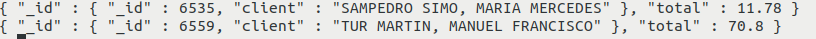
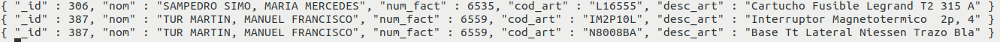

# **Implementación de Relaciones en MongoDB**


MongoDB, al ser una **base de datos NoSQL**, **no maneja relaciones de la misma manera que SQL**. Sin embargo, permite representar relaciones entre documentos utilizando dos enfoques principales:

1️⃣ Relaciones mediante documentos embebidos.  
2️⃣ Relaciones mediante referencias.

Cada enfoque tiene ventajas y desventajas, según el caso de uso.

---

## 4.1. Relación con Documentos Embebidos
Este enfoque **anida los datos relacionados dentro del mismo documento**.  
Se usa cuando los datos relacionados se consultan frecuentemente juntos y no crecen demasiado en tamaño.

**<u>Ejemplo</u>:** Cliente con sus Pedidos embebidos

    {
      "_id": 1,
      "nombre": "Juan",
      "email": "juan@email.com",
      "pedidos": [
        { "producto": "Laptop", "total": 1200 },
        { "producto": "Mouse", "total": 25 }
      ]
    }


✅ **Ventajas**  
✔ Rápida recuperación de datos (no requiere `JOINs`).  
✔ Menos consultas a la base de datos.  
✔ Buena opción si los datos no crecen demasiado.  

❌ **Desventajas**  
✖ Si los pedidos crecen mucho, el documento se hace muy grande.  
✖ No se pueden actualizar pedidos de forma independiente sin modificar el cliente.  

---

## 4.2. Relación con Referencias
En este enfoque, los documentos **almacenan solo referencias (IDs) de documentos en otras colecciones**.  
Se usa cuando los datos son reutilizados en múltiples documentos o crecen mucho en tamaño.  
Estas referencias pueden ser de dos tipos; referencias manuales o por DBRefs.

**<u>Ejemplo</u>:** Cliente y Pedidos en colecciones separadas con referencia 

 **Colección `clientes`**

    {
      "_id": 1,
      "nombre": "Juan",
      "email": "juan@email.com",
      "pedidos": [101, 102]  // Referencias a pedidos
    }


 **Colección `pedidos`**

    [
      { "_id": 101, "cliente_id": 1, "producto": "Laptop", "total": 1200 },
      { "_id": 102, "cliente_id": 1, "producto": "Mouse", "total": 25 }
    ]


✅ **Ventajas**  
✔ Evita documentos muy grandes.  
✔ Permite reutilizar datos sin duplicarlos.  
✔ Se pueden actualizar las referencias sin modificar el documento original.  

❌ **Desventajas**  
✖ Se necesitan consultas adicionales (`$lookup`) para traer los datos completos.  
✖ Puede ser más lento en consultas frecuentes.  

---

!!!Tip ""Regla general" 
    - **Si los datos relacionados son de uso frecuente y pequeños →** Usa documentos embebidos.  
    - **Si los datos crecen mucho o se usan en varias colecciones →** Usa referencias con `$lookup`.  

---

## 4.3. Relaciones en MongoDB con `$lookup`

En **MongoDB**, la agregación con **$lookup** permite realizar joins entre colecciones.  
Es útil cuando seguimos un enfoque de **modelado de datos con referencias**, donde almacenamos solo el **ObjectId** en lugar de los documentos embebidos.

!!!Note "Sintaxis"
  ```
      {   
        $lookup: {       
          from: <collection_to_join>,     
          localField: <field_from_the_input_documents>,       
          foreignField: <field_from_collection>,
          as: <output_array_field>     
        }
      }
  ```
**<u>Ejemplo 1</u>:** Relacionar la coleción Usuarios con sus Pedidos

* **Colección `usuarios`**  

        [
          { "_id": 1, "nombre": "Carlos", "email": "carlos@example.com" },
          { "_id": 2, "nombre": "Ana", "email": "ana@example.com" }
        ]

* **Colección `pedidos`**

        [
          { "_id": 101, "usuario_id": 1, "producto": "Laptop", "precio": 1200 },
          { "_id": 102, "usuario_id": 1, "producto": "Mouse", "precio": 50 },
          { "_id": 103, "usuario_id": 2, "producto": "Teclado", "precio": 80 }
        ]


* **Consulta** con **`$lookup`** para unir usuarios con sus pedidos

        db.usuarios.aggregate([
          {
            "$lookup": {
              "from": "pedidos",         // Colección a unir
              "localField": "_id",       // Campo en la colección actual (usuarios)
              "foreignField": "usuario_id", // Campo en la otra colección (pedidos)
              "as": "pedidos"            // Nombre del campo de salida con los pedidos
            }
          }
        ])

* **Resultado** esperado

        [
          {
            "_id": 1,
            "nombre": "Carlos",
            "email": "carlos@example.com",
            "pedidos": [
              { "_id": 101, "usuario_id": 1, "producto": "Laptop", "precio": 1200 },
              { "_id": 102, "usuario_id": 1, "producto": "Mouse", "precio": 50 }
            ]
          },
          {
            "_id": 2,
            "nombre": "Ana",
            "email": "ana@example.com",
            "pedidos": [
              { "_id": 103, "usuario_id": 2, "producto": "Teclado", "precio": 80 }
            ]
          }
        ]


**<u>Ejemplo 2</u>**: Realcionar la colección autores con sus libros.

        db.createCollection("authors");
        db.createCollection("books");

        // Primera instrucción
        db.authors.insertOne({
          name: "Diego",
          email: "dcortes@example.com",
          age: 25
        });

        // Segunda instrucción (Se debe obtener el ID del autor y remplazar)
        db.books.insertMany([
          {
            name: "Philosopher's Stone",
            author_id: ObjectId("id_of_author")
          },
          {
            name: "Secret of programming",
            author_id: ObjectId("id_of_author")
          }
        ]);  


        db.getCollection("authors").aggregate([{
          $lookup: {
            from: "books",
            localField: "_id",
            foreignField: "author_id",
            as: "books"
          }
        }]);

* **Resultado** esperado

        {
            "_id" : ObjectId("64a8397a001cd56690c6a9cd"),
            "name" : "Diego",
            "email" : "dcortes@example.com",
            "age" : NumberInt(25),
            "books" : [
                {
                    "_id" : ObjectId("64a839a7001cd56690c6a9ce"),
                    "name" : "Philosopher's Stone",
                    "author_id" : ObjectId("64a8397a001cd56690c6a9cd")
                },
                {
                    "_id" : ObjectId("64a839a7001cd56690c6a9cf"),
                    "name" : "Secret of programming",
                    "author_id" : ObjectId("64a8397a001cd56690c6a9cd")
                }
            ]
        }  


### $lookup anidado

Siguiendo con el ejemplo de usuarios y sus pedidos, si cada pedido tiene detalles en una tercera colección **detalles_pedido**, podemos anidar otro $lookup:

**<u>Ejemplo</u>:** Relacionar Usuarios con Pedidos y detalles_pedido

* **Colección `usuarios`**

        [
          { "_id": 1, "nombre": "Carlos", "email": "carlos@example.com" },
          { "_id": 2, "nombre": "Ana", "email": "ana@example.com" }
        ]

* **Colección `pedidos`**

        [
          { "_id": 101, "usuario_id": 1, "producto": "Laptop", "precio": 1200 },
          { "_id": 102, "usuario_id": 1, "producto": "Mouse", "precio": 50 },
          { "_id": 103, "usuario_id": 2, "producto": "Teclado", "precio": 80 }
        ]

* **Colección `detalles_pedido`**

        [
          { "_id": 201, "pedido_id": 101, "cantidad": 1, "garantia": "2 años" },
          { "_id": 202, "pedido_id": 102, "cantidad": 2, "garantia": "1 año" },
          { "_id": 203, "pedido_id": 103, "cantidad": 1, "garantia": "3 años" }
        ]

* Consulta con **`$lookup` anidado** 

La idea es obtener una lista de usuarios con sus pedidos, y dentro de cada pedido, los detalles de ese pedido.

          db.usuarios.aggregate([
          {
            "$lookup": {
              "from": "pedidos",
              "localField": "_id",
              "foreignField": "usuario_id",
              "as": "pedidos"
            }
          },
          {
            "$unwind": "$pedidos"  // Descompone el array de pedidos
          },
          {
            "$lookup": {
              "from": "detalles_pedido",
              "localField": "pedidos._id",
              "foreignField": "pedido_id",
              "as": "pedidos.detalles"
            }
          },
          {
            "$group": {
              "_id": "$_id",
              "nombre": { "$first": "$nombre" },
              "email": { "$first": "$email" },
              "pedidos": { "$push": "$pedidos" }
            }
          }
        ])

* **Resultado** esperado

        [
          {
            "_id": 1,
            "nombre": "Carlos",
            "email": "carlos@example.com",
            "pedidos": [
              {
                "_id": 101,
                "usuario_id": 1,
                "producto": "Laptop",
                "precio": 1200,
                "detalles": [
                  { "_id": 201, "pedido_id": 101, "cantidad": 1, "garantia": "2 años" }
                ]
              },
              {
                "_id": 102,
                "usuario_id": 1,
                "producto": "Mouse",
                "precio": 50,
                "detalles": [
                  { "_id": 202, "pedido_id": 102, "cantidad": 2, "garantia": "1 año" }
                ]
              }
            ]
          },
          {
            "_id": 2,
            "nombre": "Ana",
            "email": "ana@example.com",
            "pedidos": [
              {
                "_id": 103,
                "usuario_id": 2,
                "producto": "Teclado",
                "precio": 80,
                "detalles": [
                  { "_id": 203, "pedido_id": 103, "cantidad": 1, "garantia": "3 años" }
                ]
              }
            ]
          }
        ]

---
🎯 Explicación del Pipeline  


- $lookup (usuarios → pedidos): Une los pedidos a cada usuario.
- $unwind (pedidos): Descompone la lista de pedidos para poder hacer otro $lookup.
- $lookup (pedidos → detalles_pedido): Une los detalles a cada pedido.
- $group: Vuelve a agrupar los datos para reconstruir la estructura.

### El operador `$unwind`
  
El operador **$unwind** en MongoDB descompone un array dentro de un documento en múltiples documentos, cada uno con un solo elemento del array.

Es especialmente útil cuando trabajamos con **$lookup**, porque las consultas de agregación en MongoDB manejan arrays, y a veces es necesario convertirlos en documentos individuales para hacer más joins o transformaciones.

**¿Cuándo se usa $unwind?**  

  ✔ Cuando necesitas descomponer arrays en documentos individuales.  
  ✔ Para hacer joins en múltiples niveles (como unir detalles_pedido a cada pedido).  
  ✔ Para hacer cálculos en elementos individuales de un array, como contar cuántos productos ha comprado un usuario.

!!!Note "Ejemplo sin $unwind"
          db.usuarios.aggregate([
            {
              "$lookup": {
                "from": "pedidos",
                "localField": "_id",
                "foreignField": "usuario_id",
                "as": "pedidos"
              }
            }
          ])

      **Resultado**

            [
              {
                "_id": 1,
                "nombre": "Carlos",
                "pedidos": [
                  { "_id": 101, "usuario_id": 1, "producto": "Laptop", "precio": 1200 },
                  { "_id": 102, "usuario_id": 1, "producto": "Mouse", "precio": 50 }
                ]
              },
              {
                "_id": 2,
                "nombre": "Ana",
                "pedidos": [
                  { "_id": 103, "usuario_id": 2, "producto": "Teclado", "precio": 80 }
                ]
              }
            ]

Cada usuario tiene un array con sus pedidos, pero si queremos hacer un segundo $lookup (por ejemplo, para unir detalles de los pedidos), MongoDB no puede unir arrays directamente.

!!!Note "Ejemplo con $unwind"
          db.usuarios.aggregate([
            {
              "$lookup": {
                "from": "pedidos",
                "localField": "_id",
                "foreignField": "usuario_id",
                "as": "pedidos"
              }
            },
            {
              "$unwind": "$pedidos"
            }
          ])

      **Resultado**

            [
              {
                "_id": 1,
                "nombre": "Carlos",
                "pedidos": { "_id": 101, "usuario_id": 1, "producto": "Laptop", "precio": 1200 }
              },
              {
                "_id": 1,
                "nombre": "Carlos",
                "pedidos": { "_id": 102, "usuario_id": 1, "producto": "Mouse", "precio": 50 }
              },
              {
                "_id": 2,
                "nombre": "Ana",
                "pedidos": { "_id": 103, "usuario_id": 2, "producto": "Teclado", "precio": 80 }
              }
            ]

Ahora, cada usuario tiene múltiples documentos, uno por cada pedido, lo que permite realizar otro $lookup con detalles_pedido.

----
## :pencil2: Exercici 4

Intenta implementar en MongoDB part de la Base de Dades relacional [**factures**](https://asalvadorc.github.io/BBDD_PostgreSQL_DML/exercicis_de_tot_el_tema/),  concretament, comença per les taules CATEGORIA i ARTICLE, que les hauràs de
representar com a documents de 2 col·leccions (col·lecció **categoria** i col·lecció **articulo**).
En els documents de la col·lecció **categoria**, el codi de categoria serà el
**_id** , mentre que en els documents de la col·lecció **articulo**, el codi de
l'article serà el **_id**.

  1. Insereix els documents corresponents a les categories de l'exercici **Ex_1** ([**factures**](https://asalvadorc.github.io/BBDD_PostgreSQL_DML/exercicis_de_tot_el_tema/)).
  2. Insereix els documents corresponents als articles de l'exercici **Ex_2** ([**factures**](https://asalvadorc.github.io/BBDD_PostgreSQL_DML/exercicis_de_tot_el_tema/)).
  3. Fes una consulta en què apareguen tots els articles amb la seua descripció i també la descripció de la seua categoria.
  4. Modifica l'anterior per a que apareguen només les descripcions de l'article i de la categoria.
    * Com que les dades del document reunit, que en aquest cas és categoria, podem utilitzar **$unwind** per a "desconstruir" aquest array.
    * Una vegada desconstruït l'array és quan podrem projectar sobre la descripció de l'article (directament) i sobre la descripció de la categoria reanomenant el camp i subcamp.
  5. Fes una consulta on aparega la descripció de cada categoria, amb el número d'articles de cada categoria i el preu mitjà.
  6. Insereix els documents corresponents als clients de l'exercici **Ex_3** ([**factures**](https://asalvadorc.github.io/BBDD_PostgreSQL_DML/exercicis_de_tot_el_tema/)). No ens importarà el codi de població.
  7. Insereix les factures corresponents als exercicis **Ex_4** ([**factures**](https://asalvadorc.github.io/BBDD_PostgreSQL_DML/exercicis_de_tot_el_tema/)) i **Ex_5** ([**factures**](https://asalvadorc.github.io/BBDD_PostgreSQL_DML/exercicis_de_tot_el_tema/)). Observa que la millor manera d'introduir les línies de factura és dins de la mateixa factura, en un array.
  8. Fes una consulta per a traure el número de factura i el seu total.

      

  9. Modifica l'anterior per a traure també el nom del client de la factura

      

  10. Trau un llistat de clients, com a mínim amb el seu nom, i dels articles que ha comprat, com a mínim amb la descripció de l'article

    

Llicenciat sota la  [Llicència Creative Commons Reconeixement NoComercial
SenseObraDerivada 4.0](http://creativecommons.org/licenses/by-nc-nd/4.0/)
   


