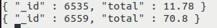

# :pencil2: Exercicis

## Exercici 2

Sobre la teua Base de Dades **MONGODB** treballarem sobre la col·lecció
**libro**, la mateixa que hem utilitzat en els exemples. Si no la tens
creada, executa les sentències del principi de la pregunta **3.8 - Operadors de consulta/ Operadors**. Fes les següents consultes. Copia-les en un únic fitxer de text, de forma numerada. És aquest fitxer el que hauràs de pujar.

  1. Busca els llibres que tenen més de 500 pàgines. Visualitza el _id, el títol i el número de pàgines.
  2. Busca els llibres de l'any 2014. Visualitza únicament títol i data.
  3. Busca els llibres de l'editorial Planeta. Visualitza únicament títol i editorial.
  4. Busca els llibres de l'editorial Planeta de més de 500 pàgines. Visualitza únicament títol, editorial i pàgines.
  5. Busca els llibres que no tenen editorial. Visualitza únicament títol i editorial.
  6. Busca els llibres que en el resum contenen la paraula **caballo**. Visualitza el resum per poder comprovar-ho. Han d'eixir 2 llibres, **Circo máximo** i **Las carreras de Escorpio**.
  7. Utilitzant la funció **aggregate** , trau l'editorial i la mitjana de pàgines d'aquelles editorials que tenen una mitjana de pàgines superior a 500. Eixiran 3 editorials.

## Exercici 3

Sobre la teua Base de Dades MONGODB treballarem sobre la col·lecció **libro**
, la mateixa que hem utilitzat en els exemples. Si no la tens creada, executa
les sentències del principi de la pregunta **3.8 - Operadors de consulta/ Operadors**. Fes les següents consultes. Copia-les en un únic fitxer de text, de forma numerada. És aquest
fitxer el que hauràs de pujar.

  1. Incrementar el preu dels llibres de l'editorial Planeta en 2€ (recordeu que per a modificar més d'un document, hem de posar com a tercer paràmetre l'opció **{multi:true}**).
  2. Crear el camp editorial amb el valor nul, per a tots aquells documents que no tinguen el camp editorial.
  3. Fer l'operació inversa: eliminar el camp editorial per a tots aquells que el tinguen nul.
  4. Traure l'any del llibre, a partir de la **fecha** (serà un camp calculat anomenat **año**).
  5. Aprofita el camp anterior per a traure els llibres estrictament anteriors a l'any 2013. Visualitza **titulo** , **fecha** i **año**.

## Exercici 4

Aquest exercici l'has de realitzar sobre la teua BD de MongoDB.

    
    
    title : Fight Club
    writer : Chuck Palahniuk
    year : 1999
    actors : [
      Brad Pitt
      Edward Norton ]
    
    
    title : Pulp Fiction
    writer : Quentin Tarantino
    year : 1994
    actors : [
      John Travolta
      Uma Thurman ]
    
    
    
    title : Inglorious Basterds
    writer : Quentin Tarantino
    year : 2009
    actors : [
      Brad Pitt
      Diane Kruger
      Eli Roth ]
    
    
    title : The Hobbit: An Unexpected Journey
    writer : J.R.R. Tolkein
    year : 2012
    franchise : The Hobbit
    
    
    title : The Hobbit: The Desolation of Smaug
    writer : J.R.R. Tolkein
    year : 2013
    franchise : The Hobbit
    
    
    title : The Hobbit: The Battle of the Five Armies
    writer : J.R.R. Tolkein
    year : 2012
    franchise : The Hobbit
    synopsis : Bilbo y compañía se ven obligados a participar en una guerra contra una serie de combatientes y evitar que la Lonely Mountain caiga en manos de una oscuridad creciente.
    
    
    
    title : Pee Wee Herman's Big Adventure
    
    
    title : Avatar

  1. Inserir tots els documents anteriors. Ha de ser **obligatòriament** amb una única sentència, per a la qual cosa hauràs d'utilitzar variables, una per a cada document.
  2. Consultar tots els documents
  3. Obtenir els documents amb **writer** igual a **"Quentin Tarantino"**
  4. Obtenir els documents amb **actors** que incloguen a **"Brad Pitt"**
  5. Obtenir els documents amb **franchise** igual a **"The Hobbit"**
  6. Obtenir totes les pel·lícules dels anys 90.
  7. Obtenir les pel·lícules estrenades entre l'any 2000 i el 2010.
  8. Agregar sinopsis a **"The Hobbit: An Unexpected Journey"** : 
     * "Un hobbit reacio, Bilbo Baggins, se dirige a Lonely Mountain con un enérgico grupo de enanos para reclamar su hogar en la montaña, y el oro que contiene, del dragón Smaug".
  9. Agregar sinopsis a **"The Hobbit: The Desolation of Smaug** ": 
     * "Los enanos, junto con Bilbo Baggins y Gandalf the Grey, continúan su búsqueda para recuperar Erebor, su tierra natal, de manos de Smaug. Bilbo Baggins está en posesión de un anillo misterioso y mágico".
  10. Agregar un actor anomenat **"Samuel L. Jackson"** a la pel·lícula "Pulp Fiction"
  11. Trobar les pel·lícules que en la sinopsis continguen la paraula **"Bilbo"**
  12. Trobar les pel·lícules que en la sinopsis continguen la paraula **"Gandalf"**
  13. Trobar les pel·lícules que en la sinopsis continguen la paraula **"Bilbo"** i no la paraula **"Gandalf"**. S'aconsella utilitzar l'operador **$and**
  14. Trobar les pel·lícules que en la sinopsis continguen la paraula **"enanos"** o **"hobbit"**
  15. Trobar les pel·lícules que en la sinopsis continguen les paraules **"oro"** i **"dragón"**
  16. Eliminar la pel·lícula **"Pee Wee Herman's Big Adventure"**
  17. Eliminar la pel·lícula **"Avatar"**
    

## Exercici 5

Intenta implementar en MongoDB part de la Base de Dades relacional [**factures**](https://asalvadorc.github.io/BBDD_PostgreSQL_DML/exercicis_de_tot_el_tema/),  concretament, comença per les taules CATEGORIA i ARTICLE, que les hauràs de
representar com a documents de 2 col·leccions anomenades de la mateixa manera.
En els documents de la col·lecció ARTICLE, el codi de categoria serà el
**_id** , mentre que en els documents de la col·lecció ARTICLE, el codi de
l'article serà el **_id**.

  1. Insereix els documents corresponents a les categories de l'exercici **Ex_1** ([**factures**](https://asalvadorc.github.io/BBDD_PostgreSQL_DML/exercicis_de_tot_el_tema/)).
  2. Insereix els documents corresponents als articles de l'exercici **Ex_2** ([**factures**](https://asalvadorc.github.io/BBDD_PostgreSQL_DML/exercicis_de_tot_el_tema/)).
  3. Fes una consulta en què apareguen tots els articles amb la seua descripció i també la descripció de la seua categoria.
  4. Modifica l'anterior per a que apareguen només les descripcions de l'article i de la categoria.
    * Com que les dades del document reunit, que en aquest cas és categoria, podem utilitzar **$unwind** per a "desconstruir" aquest array.
    * Una vegada desconstruït l'array és quan podrem projectar sobre la descripció de l'article (directament) i sobre la descripció de la categoria reanomenant el camp i subcamp.
  5. Fes una consulta on aparega la descripció de cada categoria, amb el número d'articles de cada categoria i el preu mitjà.
  6. Insereix els documents corresponents als clients de l'exercici 6.95. No ens importarà el codi de població.
  7. Insereix les factures corresponents als exercicis 6.96 i 6.97. Observa que la millor manera d'introduir les línies de factura és dins de la mateixa factura, en un array.
  8. Fes una consulta per a traure el número de factura i el seu total.

      

  9. Modifica l'anterior per a traure també el nom del client de la factura

      

  10. Trau un llistat de clients, com a mínim amb el seu nom, i dels articles que ha comprat, com a mínim amb la descripció de l'article

    

Llicenciat sota la  [Llicència Creative Commons Reconeixement NoComercial
SenseObraDerivada 4.0](http://creativecommons.org/licenses/by-nc-nd/4.0/)

